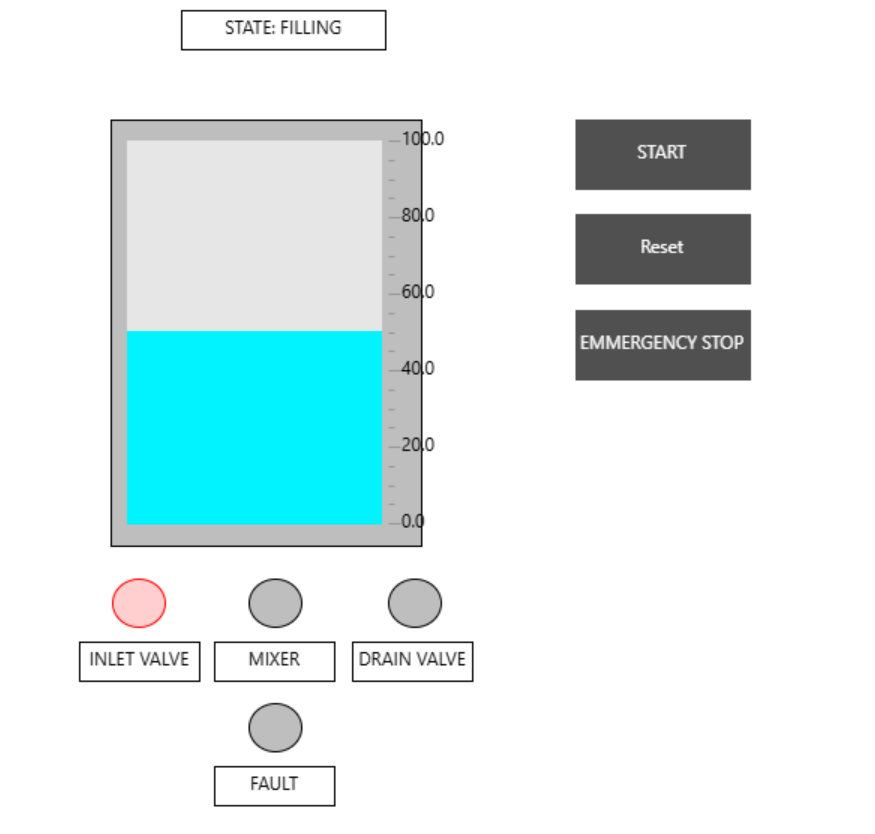
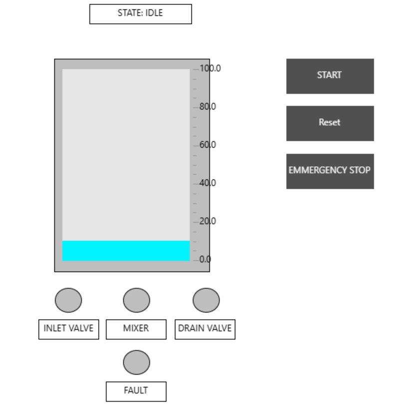
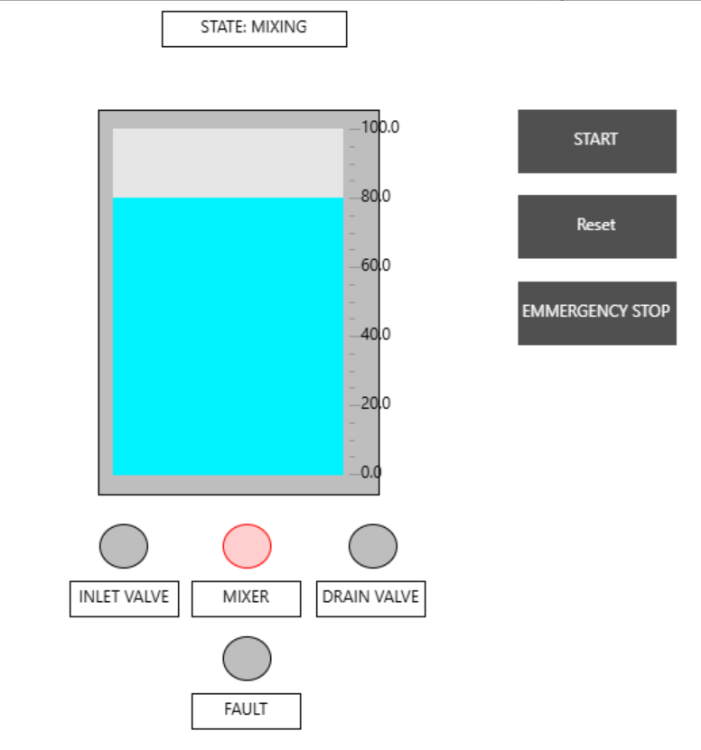
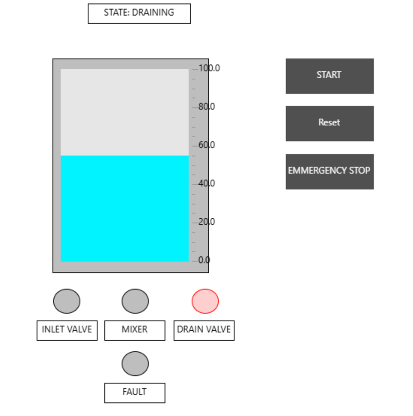
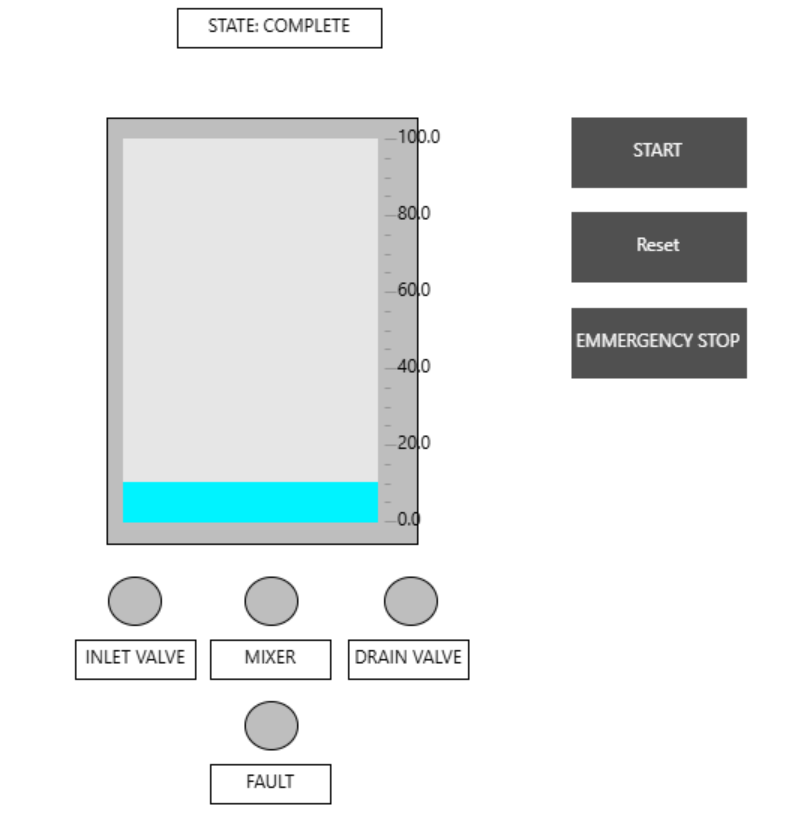
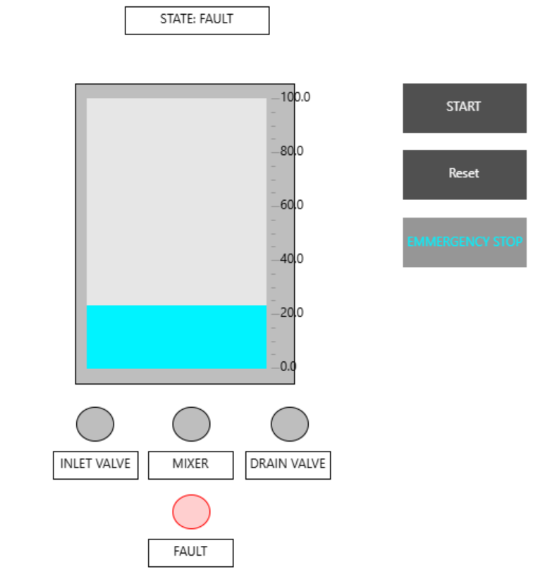
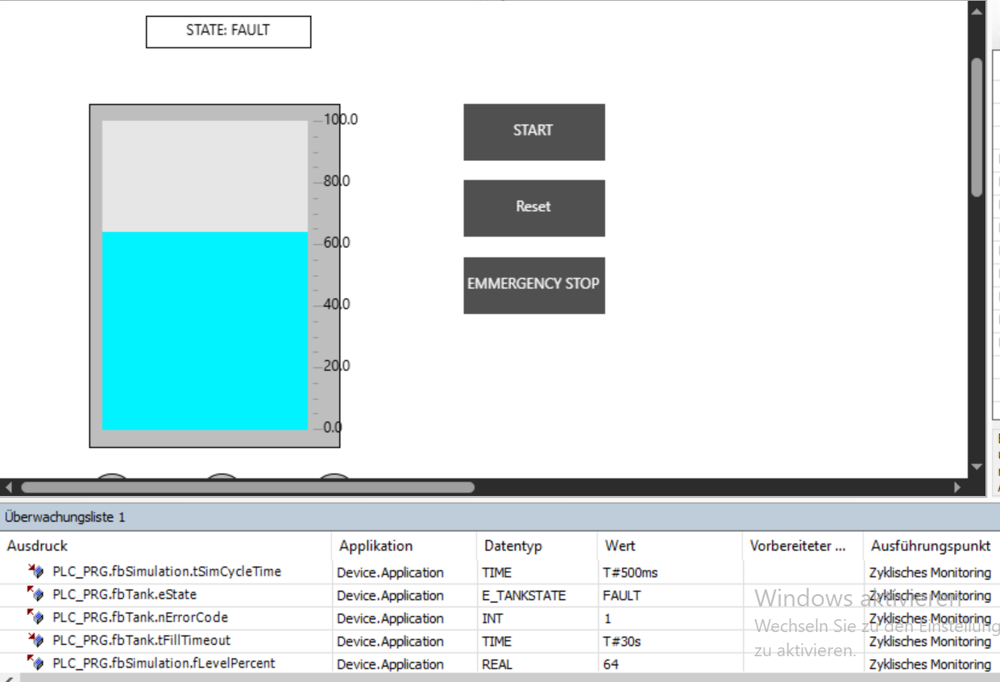
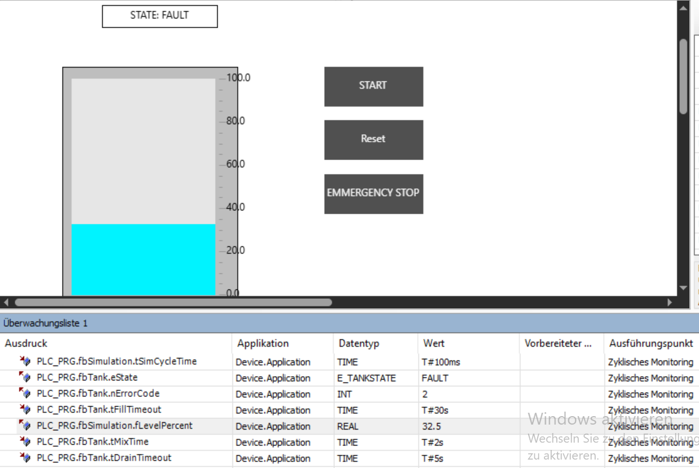
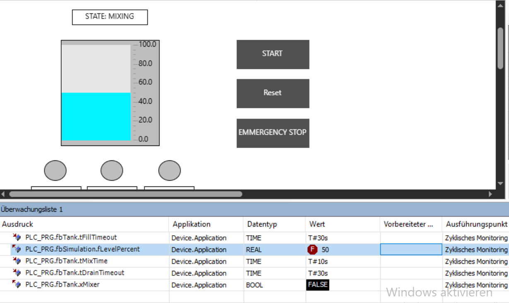

# PLC Tank Filling & Mixing Station

A simulated PLC-controlled tank that automatically fills, mixes, and drains. The control logic is written in IEC 61131-3 Structured Text and runs in the CODESYS simulation without physical hardware.



## Process sequence

1. **IDLE:** waiting for Start.
2. **FILLING:** inlet valve opens until the level reaches 80%.
3. **MIXING:** mixer runs for 10 seconds.
4. **DRAINING:** drain valve opens until the level reaches 10%.
5. **COMPLETE:** the batch is finished and waits for Reset.
6. **FAULT:** all actuators are switched off after an Emergency Stop or timeout.

## Main functions

- State machine for the complete automatic sequence
- Emergency Stop with priority over the process sequence
- Mutual exclusion between inlet and drain valves
- Mixer enabled only when the tank level is at least 80%
- Separate fill and drain timeouts with error codes
- Simulated tank level for testing without hardware
- CODESYS Visualization with level display, buttons, state text, and indicator lamps

## Technology

- CODESYS V3.5 SP22 Patch 3
- IEC 61131-3 Structured Text (ST)
- Function blocks, timers, and rising-edge detection
- CODESYS Visualization and built-in simulation

## Project structure

```text
plc-tank-filling-station/
├── README.md
├── LICENSE
├── .gitignore
├── TankFillingStation.project
├── src/
│   ├── E_TankState.st
│   ├── FB_TankController.st
│   ├── FB_TankSimulation.st
│   └── PLC_PRG.st
├── docs/
│   └── screenshots/
├── tests/
│   └── Test_Cases.md
└── export/
    ├── TankFillingStation.xml
```

## Run the project

1. Open `TankFillingStation.project` in CODESYS V3.5.
2. Select **Build → Build** or press F11.
3. Enable **Online → Simulation**.
4. Log in and start the application.
5. Open `Visualization` and press **START**.

No physical PLC or additional library is required.

## Testing

The project builds with **0 errors and 0 warnings**. Eleven of twelve manual test cases were fully executed in the CODESYS simulation and passed. The detailed procedures and observed results are documented in [`tests/Test_Cases.md`](tests/Test_Cases.md).

The executed tests include the normal batch sequence, Emergency Stop from different states, fault reset behavior, fill and drain timeouts, the mixer level interlock, and reset from COMPLETE.

### Test 10: valve mutual exclusion

Test 10 checks that the inlet valve and drain valve can never be active together.

During a normal batch, both final outputs were monitored at several points and were never observed as `TRUE` at the same time. The controller also applies the following output interlock:

```iecst
xInletValve := xInletValveCmd AND NOT xDrainValveCmd;
xDrainValve := xDrainValveCmd AND NOT xInletValveCmd;
```

An additional fault-injection attempt forced `xDrainValveCmd` to `TRUE` during FILLING. The Watch List displayed the forced value as `TRUE`, but `xInletValve` remained `TRUE`. This attempt was not a valid test of the interlock because `xDrainValveCmd` is an internal variable that the PLC program writes again during every scan. The value shown at the scan boundary can therefore differ from the value used when the interlock lines are executed.

For this reason, Test 10 is recorded as **partially verified by normal-cycle observation and code review**, not as a completed runtime fault-injection test. This is a limitation of the test method, not evidence that the interlock failed.

## Screenshots

<table>
<tr>
  <td align="center" width="33%"><b>IDLE</b><br>waiting for Start</td>
  <td align="center" width="33%"><b>FILLING</b><br>inlet valve open</td>
  <td align="center" width="33%"><b>MIXING</b><br>full at 80%</td>
</tr>
<tr>
  <td></td>
  <td></td>
  <td></td>
</tr>
<tr>
  <td align="center"><b>DRAINING</b><br>drain valve open</td>
  <td align="center"><b>COMPLETE</b><br>waiting for Reset</td>
  <td align="center"><b>FAULT</b><br>E-Stop, everything off</td>
</tr>
<tr>
  <td></td>
  <td></td>
  <td></td>
</tr>
</table>

Only one actuator lamp is ever lit, the mixer runs only at 80%, and in FAULT
everything goes dark at once.

### Test evidence

**Fill timeout** — faulted at 64%, error code 1



**Drain timeout** — error code 2



**Mixer interlock** — mixer off while the state is still MIXING



## License

This project is released under the [MIT License](LICENSE).
